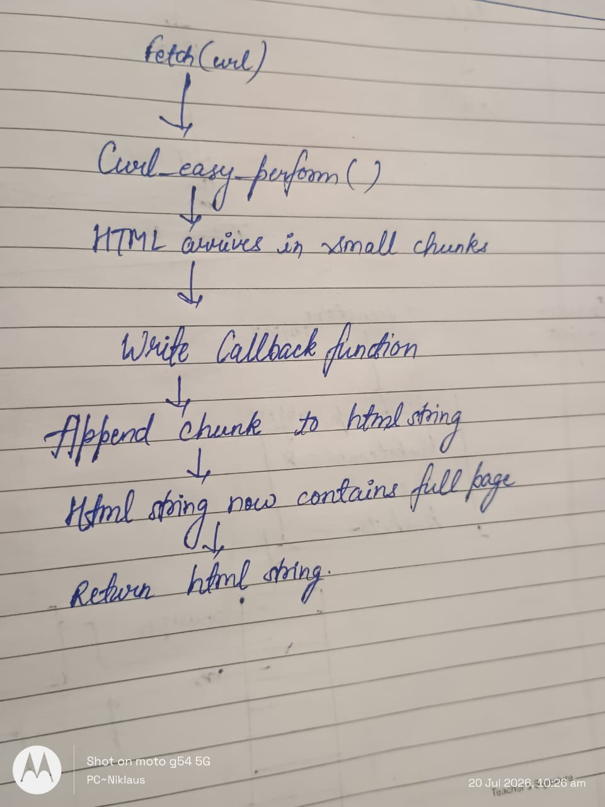

# Daily Journal — 19th July

## Section 1 — Specific Bug

While configuring the project, CMake was unable to locate the libcurl library required by the Fetcher module.

After resolving the build configuration, I also encountered another issue while implementing the Fetcher. The webpage request completed successfully, but the returned HTML was empty because I had not correctly implemented the libcurl write callback function to collect the downloaded data.

---

## Section 2 — Failed Attempt

firstly I thought that `curl_easy_perform()` would directly return the webpage content after the request completed. I spent some time debugging the Fetcher because the request appeared to execute successfully, but there was no HTML available to return.

After reading the libcurl documentation and experimenting with a small test program, I realized that libcurl delivers the response in multiple chunks through a callback function. Unless every chunk is appended to a buffer inside the callback, the downloaded webpage is effectively discarded.

I also spent some time fixing the CMake configuration because libcurl was installed on my system but wasn't linked correctly to the project. Once I configured `find_package(CURL REQUIRED)` and linked the library properly, the project compiled successfully.

---

## Section 3 — Memory Diagram

### Understanding how libcurl returns webpage data

This diagram helped me understand that `curl_easy_perform()` does not directly return the webpage content. Instead, the callback function receives every chunk of downloaded data and builds the final HTML string that is returned by the Fetcher.

---

## Section 4 — Code Reference

- commit reference for git and cmake setup- **baddb9f** configured cmake, setup git repo ,install and initialize libcurl
- commit reference for adding collection loberary as submodule- **624be1e** added collection library as submodule
- commit reference-**69817b0** first version of design proposal for web crawler
- **4e0b73b** web crawler: wrote fetcher.h
- **9f605ed** web crawler: fetcher.cpp -> writeCallback() & setRequestDelay()
- **f290e1b** (HEAD -> main) web crawler: fetcher.cpp -> fetch() method implementation plus error handling

---

## Section 5 — Learning Reflection

Before today, i only knew that libcurl could be used to download webpages, but I didn't understand how the downloaded data was actually returned to the program. While implementing the Fetcher, i learned that libcurl follows a callback design where the response is received in chunks rather than as a single return value. 

Working on the crawler design proposal also learned the importance of keeping responsibilities separate between different components. Rather than putting all the logic inside the crawler class, defining dedicated modules such as the Fetcher, Frontier, URL Normalizer, Seen URL Store, and Page Storage makes the architecture easier to understand, maintain, and extend. This modular design will also allow me to replace the current libcurl based Fetcher(static) with a browser based (dynamic) implementation in the future without affecting the rest of the crawler.