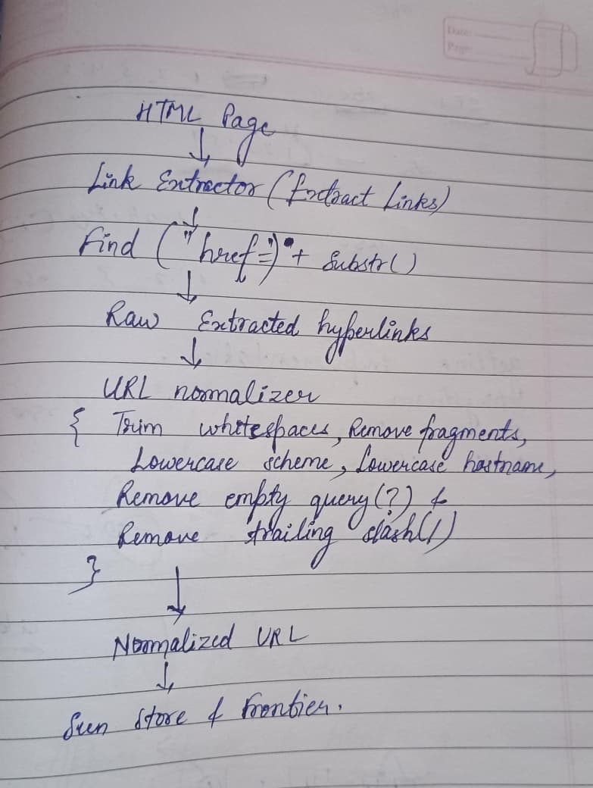

# Daily Journal — 21st July

## Section 1 — Specific Bug

While implementing the URL Normalizer, I ran into an issue with handling trailing slashes and empty query strings correctly. Initially, I removed the trailing slash whenever the URL ended with `/`, but I later realized that this could incorrectly modify URLs where the slash was actually part of the query string.

For example,

```text
https://example.com/page?/
```

In this case the `/` belongs to the query, not the path, so blindly removing it would change the meaning of the URL.

I also spent some time deciding which normalization rules should actually be implemented in the first version of the crawler without making the implementation unnecessarily complicated.

---

## Section 2 — Failed Attempt

The first implementation of the URL Normalizer focused only on lowercasing the scheme and hostname, but after revisiting the crawler documentation I realized that this alone would not prevent duplicate page visits. URLs such as

```text
https://example.com/page
https://example.com/page/
HTTPS://EXAMPLE.COM/PAGE
https://example.com/page?
```

would still be treated as different strings by the Seen URL Store.

While implementing trailing slash removal, my initial logic simply removed the last slash whenever one existed. After testing different URL formats, I discovered that this approach failed for cases where the slash belonged to the query string instead of the path. I spent some time reasoning through different URL structures before settling on a safer implementation that only removes redundant trailing slashes while preserving the root slash after the hostname.

Another decision I had to make was choosing an approach for hyperlink extraction. I initially considered using algorithms such as KMP or regular expressions, but after comparing them with the problem at hand, I realized they would only add unnecessary complexity for matching the fixed pattern `href=`. I therefore implemented the Link Extractor using simple string searching with `find()` and `substr()`, which kept the implementation straightforward and efficient.

---

## Section 3 — Memory Diagram

### URL extraction and normalization pipeline




---

## Section 4 — Code Reference

- **c738f07** implemented Link Extractor using `find()` and `substr()`
- **4dd79ac** created `url_normalizer.h`
- **eebc588** implemented whitespace trimming and fragment removal
- **eb1d6ab** implemented scheme and hostname lowercase conversion

---

## Section 5 — Learning Reflection

Before today, I understood that URL normalization was useful, but I did not fully appreciate how important it is for preventing duplicate crawling. While implementing the URL Normalizer, I learned that two URLs can look different as strings while still referring to the exact same webpage. Even simple differences such as uppercase letters in the hostname, an unnecessary trailing slash, or an empty query string can cause the crawler to revisit pages and store duplicate copies if they are not normalized first.

Working on the URl normalizer also reinforced the idea that choosing the simplest solution is often the better engineering decision. Although algorithms like KMP and regular expressions are powerful, they were unnecessary for extracting hyperlinks from HTML in this project. A straightforward combination of `find()` and `substr()` was easier to understand, easier to maintain, and completely sufficient for the current crawler requirements.

Today's work also highlighted the importance of keeping crawler components independent. The Link Extractor is only responsible for finding hyperlinks, while the URL Normalizer is responsible for converting them into a consistent representation. Separating these responsibilities keeps the crawler modular and makes it much easier to extend individual components in future versions.

