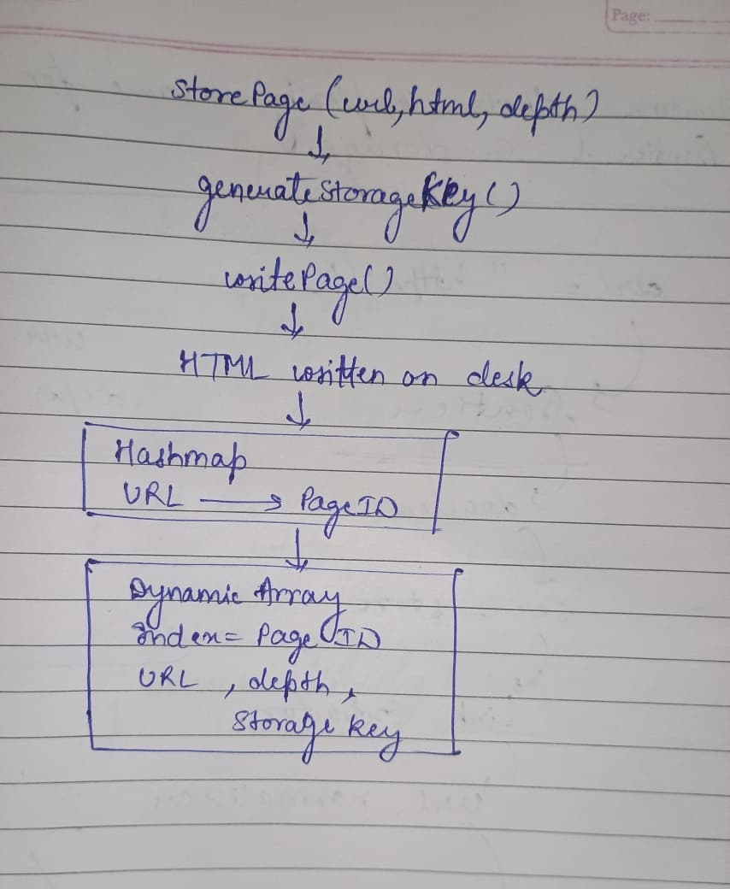

# Daily Journal — 22nd July

## Section 1 — Specific Bug

The main challenge today was designing the Page Storage component so that it remained both efficient and extensible. Initially, I planned to use only a `DynamicArray` for storing page metadata, but I realized that URL-based lookups would require a linear search. I also wanted the storage implementation to remain independent of the filesystem so it can later be replaced with a database without changing the public API.

---

## Section 2 — Failed Attempt

The Seen Store was straightforward to implement since it only needed to record whether a URL had been visited. I reused the custom `HashMap` from Project 1 to map URLs to boolean values.

For Page Storage, my first idea was to store all metadata inside a `DynamicArray` indexed by Page ID. While this worked for sequential access, retrieving pages by URL would become inefficient as the number of pages increased. Using only hash maps wasn't ideal either because Project 03 requires sequential traversal by Page ID.

I finally settled on a hybrid approach by combining a `HashMap` for URL-to-PageID lookup with a `DynamicArray` for sequential page metadata. I also hid all filesystem operations behind private helper methods like `generateStorageKey()`, `writePage()`, and `readPage()`, keeping the storage implementation separate from the public interface.

---

## Section 3 — Memory Diagram

### Page Storage Internal Design

---

## Section 4 — Code Reference

### Seen Store

- **ca0f817** implemented `seen_store.cpp` using the custom `HashMap`
- **7df5210** added `seen_store.h`

### Page Storage

- **acfb491** wrote `page_storage.h`
- **fce5ec6** implemented constructor and `writePage()`
- **eafe5ca** implemented `readPage()`
- **044f48f** implemented `storePage()`, `getPage()`, `hasPage()`, `getURLByID()` and `pageCount()`
- **54640ed** implemented `clear()`

---

## Section 5 — Learning Reflection

so today i  learned the importance of hiding implementation details behind a clean API. By keeping all file operations inside private helper methods, the Page Storage component can later switch from filesystem storage to a database without affecting the rest of the crawler.
i also learned that choosing the right data structure depends on the required operations. A `DynamicArray` is efficient for Page ID traversal, while a `HashMap` provides fast URL lookups. Combining both gave the best balance between performance and simplicity. 
