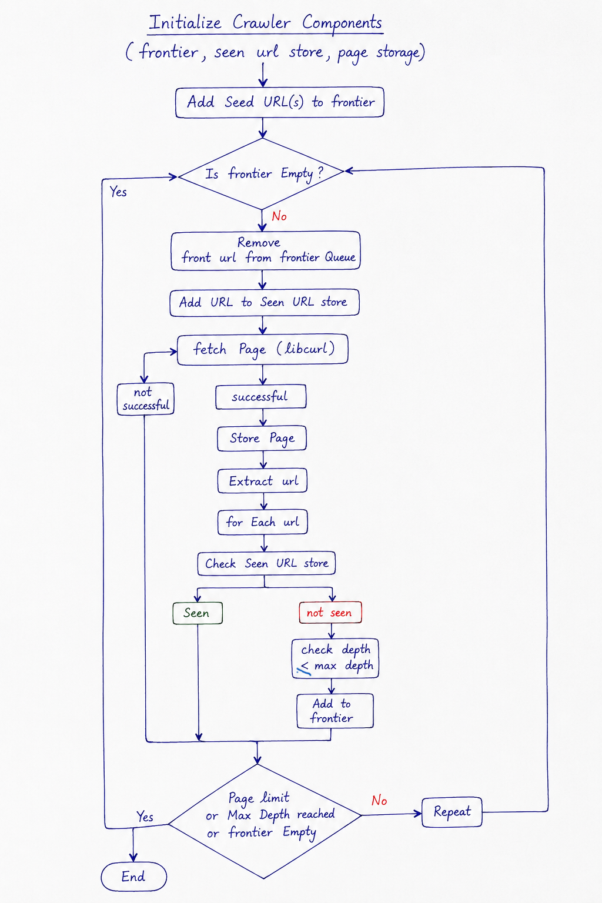
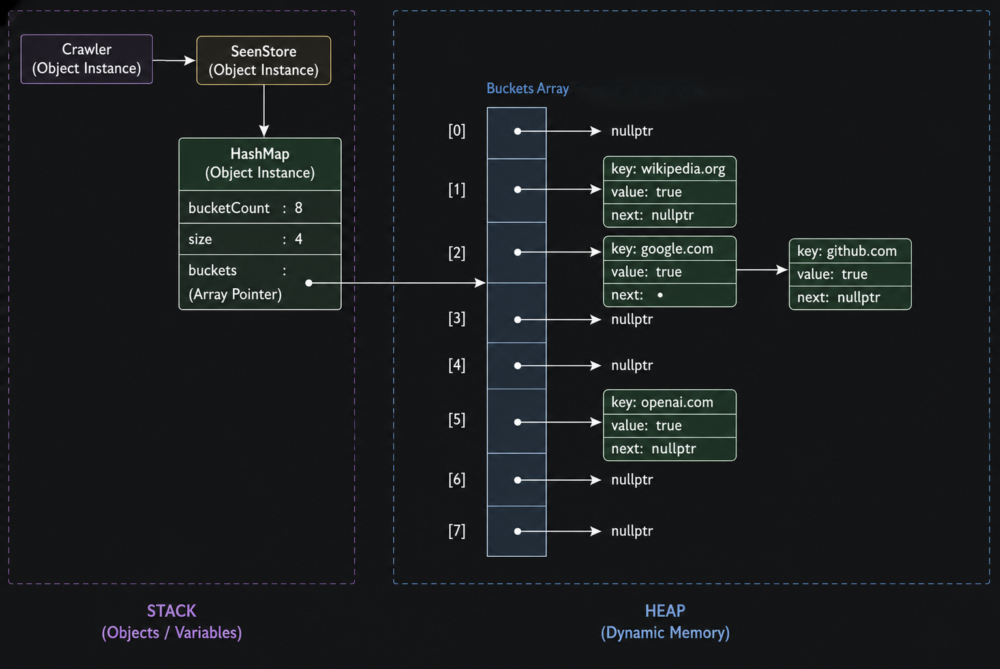
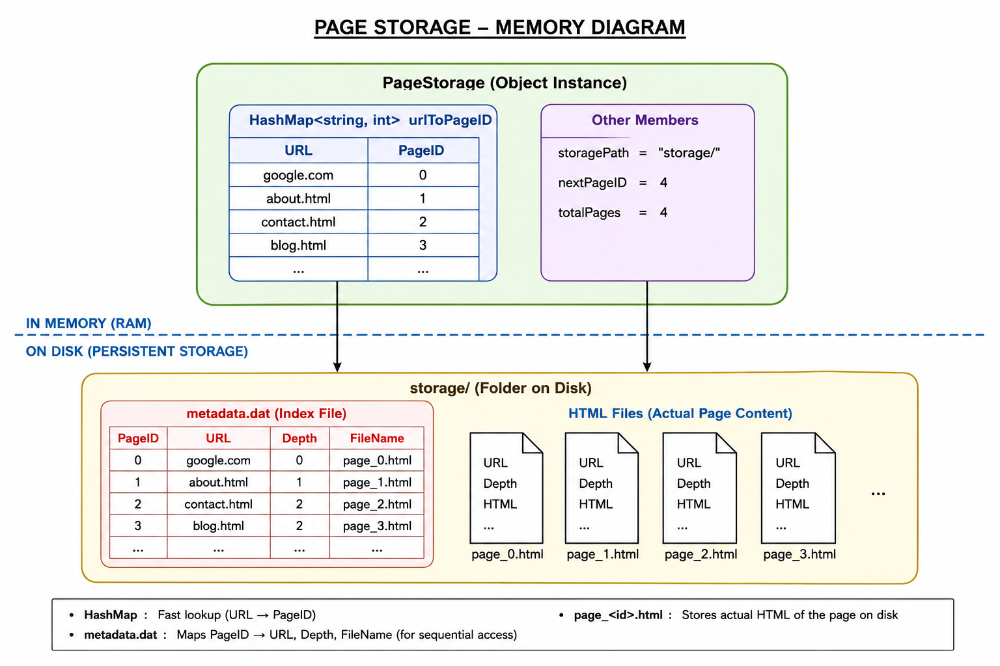
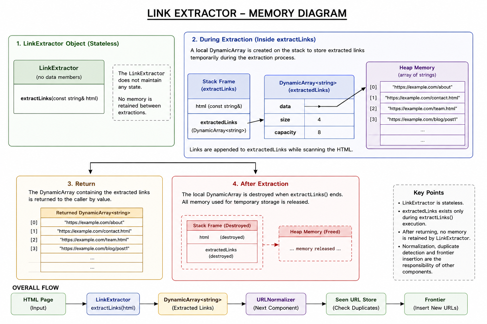
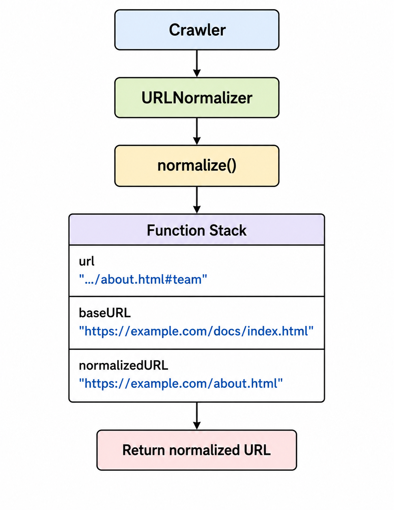
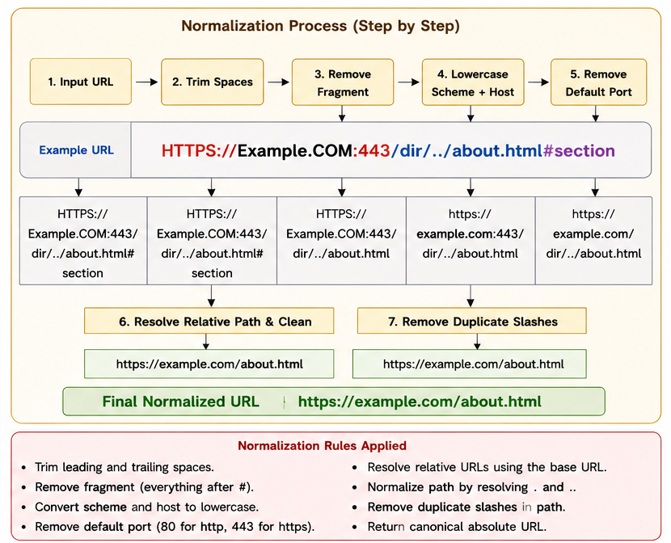

# Project 2: Web Crawler Design Proposal
## Objective
The objective of this project is to design and implement a Web Crawler capable of automatically discovering, downloading, and storing webpages starting from one or more seed URLs.
The crawler repeatedly fetches webpages, extracts hyperlinks, discovers new pages, avoids revisiting previously crawled URLs, and stores the downloaded HTML along with its crawl information for future processing.
The crawler is built entirely using the custom Collections Library developed in Project 01, reusing the following data structures:
- Dynamic Array
- Linked List
- HashMap
The stored webpages will serve as the input for Project 03 (Indexer), which will process the HTML documents to construct an inverted index for efficient search.

---
## Component Design

---
### Crawler
#### Purpose
The Crawler is the central component responsible for coordinating the entire crawling process. It manages the interaction between the Frontier, Fetcher, Link Extractor, URL Normalizer, Seen URL Store, and Page Storage.
Starting from one or more seed URLs, the crawler repeatedly retrieves URLs from the Frontier, downloads webpages, extracts hyperlinks, normalizes the extracted URLs, filters duplicates using the Seen URL Store, and stores successfully downloaded webpages in the Page Storage.
The Crawler delegates each task to its corresponding component while controlling the overall crawling workflow.
For the current implementation, the crawler is configured with a maximum crawl depth of **2** and a maximum of **100 webpages**. These limits can be modified in future versions.
---
#### Public API
```cpp
class Crawler{
public:
    Crawler(int maxDepth = 2,
            int maxPages = 100);
    void addSeedURL(const std::string& url);
    void crawl();
    int pagesCrawled() const;
    void clear();
};
```
---
#### Internal Representation
The crawler coordinates the following components.
```cpp
Frontier frontier;
Fetcher fetcher;
SeenStore seenStore;
PageStorage pageStorage;
LinkExtractor linkExtractor;
URLNormalizer urlNormalizer;
int maxDepth = 2;
int maxPages = 100;
int currentPages = 0;
```
Each component performs its dedicated task while the crawler controls the execution flow.
---
#### Memory Diagram
```text
                      Crawler
                          │
      ┌───────────────────┼────────────────────┐
      │                   │                    │
      ▼                   ▼                    ▼
  Frontier            Fetcher           Seen URL Store
      │
      ▼
Link Extractor
      │
      ▼
URL Normalizer
      │
      ▼
Page Storage

Configuration
--------------
maxDepth    = 2
maxPages    = 100
```
---
#### Complexity Analysis
| Method | Complexity | Explanation |
|---------|------------|-------------|
| `Crawler()` | O(1) | Initializes crawler components and configuration values. |
| `addSeedURL()` | O(1) | Inserts the seed URL into the Frontier. |
| `crawl()` | O(n) | Processes webpages until the Frontier becomes empty or the configured limits are reached. |
| `pagesCrawled()` | O(1) | Returns the number of successfully crawled webpages. |
| `clear()` | O(n) | Clears all crawler components and resets the crawler state. |
where **n** is the number of webpages processed during the crawling session.
---
#### Design Decisions
##### Decision 1: Use the Crawler as the Coordinator
**Decision Taken**
The Crawler coordinates the interaction between all crawler components.

**Alternative Considered**
Merge all functionality into a single class.

**Reason for Acceptance / Rejection**
Separating responsibilities keeps each component focused on a specific task while allowing the crawler to manage only the overall workflow. This improves readability, testing, and future maintenance.

**Trade-offs**
The design requires communication between multiple components but results in a cleaner and more modular architecture.

---
##### Decision 2: Configure Maximum Crawl Limits

**Decision Taken**
The crawler uses a default maximum depth of **2** and a page limit of **100**.

**Alternative Considered**
Allow unlimited crawling.

**Reason for Acceptance /Rejection**
Crawl limits prevent excessive resource consumption and ensure predictable execution while remaining configurable for future requirements.

**Trade-offs**
Some webpages beyond the configured limits may not be crawled, but execution remains controlled and efficient.
---
##### Decision 3: Delegate Specialized Tasks

**Decision Taken**
The crawler delegates webpage downloading, hyperlink extraction, URL normalization, duplicate detection, and page storage to dedicated components.

**Alternative Considered**
Perform all processing directly inside the crawling loop.

**Reason for Acceptance / Rejection**
Delegation allows each component to evolve independently. For example, the Fetcher can later support browser-based rendering without changing the crawler.

**Trade-offs**
The workflow involves multiple component interactions but provides better extensibility and code organization.
---

### Frontier
#### Purpose
The Frontier maintains the collection of URLs waiting to be crawled. Each entry stores:
- URL
- Current crawl depth
The Frontier is implemented using the custom `LinkedList` developed in Project 01 as a `queue`. A linked list naturally supports FIFO queue operations with constant-time insertion at the rear and removal from the front, making it well suited for breadth-first crawling.
---

#### Public API
```cpp
struct FrontierNode{
    std::string url;
    int depth;
};
class Frontier{
public:
    void enqueue(const std::string& url,
                 int depth);
    FrontierNode dequeue();
    const FrontierNode& front() const;
    bool isEmpty() const;
    int size() const;
    void clear();
};
```
---
#### Internal Representation
Each pending URL is represented as:
```cpp
struct FrontierNode{
    std::string url;
    int depth;
};
```
The Frontier internally maintains:
```cpp
LinkedList<FrontierNode> frontier;
```
Each node stores the URL to be crawled and its current crawl depth.
---
#### Memory Diagram


URLs are removed from the front using head and newly discovered URLs are inserted at the rear using tail, maintaining FIFO order.
---

#### Complexity Analysis
| Method | Complexity | Explanation |
|---------|------------|-------------|
| `enqueue()` | O(1) | Inserts a URL at the rear of the linked list. |
| `dequeue()` | O(1) | Removes the front URL. |
| `front()` | O(1) | Returns the first pending URL without removing it. |
| `isEmpty()` | O(1) | Checks whether the Frontier is empty. |
| `size()` | O(1) | Returns the maintained node count. |
| `clear()` | O(n) | Removes every node from the linked list. |

where **n** is the number of URLs currently stored in the Frontier.
---

#### Design Decisions
##### Decision 1: Use LinkedList for queue for the Frontier

**Decision Taken**
The Frontier is implemented using the custom `LinkedList`.

**Alternative Considered**
Use a `DynamicArray`.

**Reason for Acceptance / Rejection**
A linked list provides constant-time insertion at the rear and deletion from the front, making it ideal for implementing a FIFO queue. A DynamicArray would require shifting elements after every dequeue operation.

**Trade-offs**
The linked list requires additional memory for node pointers but provides efficient queue operations.

---
##### Decision 2: Use Breadth-First Search (BFS)
**Decision Taken**
The crawler processes URLs using a FIFO strategy, resulting in Breadth-First Search traversal.

**Alternative Considered**
Depth-First Search (DFS) using a stack.

**Reason for Acceptance / Rejection**
Breadth-First Search explores webpages level by level, making crawl depth management straightforward and ensuring nearby webpages are visited before deeper ones.

**Trade-offs**
BFS generally requires more memory because multiple levels of URLs may remain in the Frontier simultaneously. However, it provides a balanced and predictable crawling order.

### Seen URL Store
#### Purpose
The Seen URL Store maintains a record of every URL already visited by the crawler. Before processing a webpage, the crawler checks this component to determine whether the URL has been crawled previously.
By preventing duplicate visits, it eliminates redundant downloads, reduces network overhead, and prevents infinite loops caused by cyclic hyperlinks.
The Seen URL Store is implemented using the custom `HashMap` developed in Project 01, providing near constant-time insertion and lookup.
---

#### Public API
```cpp
class SeenStore{
public:
    bool contains(const std::string& url) const;
    void insert(const std::string& url);
    int count() const;
    bool isEmpty() const;
    void clear();
};
```
---
#### Internal Representation
The Seen URL Store internally maintains:
```cpp
HashMap<std::string, bool> visitedURLs;
```
- **Key:** URL
- **Value:** Boolean indicating whether the URL has been visited.
Since every stored URL represents a visited page, the value is always `true`.
---

#### Memory Diagram


The HashMap distributes URLs across buckets using the custom hashing algorithm developed in Project 01.

---

#### Complexity Analysis
| Method | Complexity | Explanation |
|---------|------------|-------------|
| `contains()` | O(1) average, O(n) worst | Checks whether a URL already exists. |
| `insert()` | O(1) average, O(n) worst | Inserts a URL into the appropriate hash bucket. |
| `count()` | O(1) | Returns the number of visited URLs. |
| `isEmpty()` | O(1) | Checks whether the store is empty. |
| `clear()` | O(n) | Removes all stored URLs. |
where **n** is the total number of visited URLs.
---

#### Design Decisions
##### Decision 1: Use HashMap for URL Storage
**Decision Taken**
The Seen URL Store is implemented using the custom `HashMap`.

**Alternative Considered**
Use a `LinkedList` or `DynamicArray`.

**Reason for Acceptance / Rejection**
Duplicate checking is performed for every discovered hyperlink. A HashMap provides near constant-time lookup and insertion, making it significantly more efficient than sequential searching.

**Trade-offs**
The HashMap requires additional memory for buckets and collision handling but greatly improves lookup performance.

---

##### Decision 2: Store a Boolean Value with Each URL
**Decision Taken**
Each URL is stored as the key, while a boolean value (`true`) is stored as the corresponding value.

**Alternative Considered**
Implement a custom hash set.

**Reason for Acceptance / Rejection**
The custom Collections Library already provides a HashMap. Storing a boolean allows the existing implementation to be reused without creating another data structure.

**Trade-offs**
A small amount of additional memory is used for the boolean value, but it avoids implementing and maintaining a separate HashSet.

---

##### Decision 3: Store Only Unique URLs
**Decision Taken**
Each URL is inserted only once.

**Alternative Considered**
Allow duplicate entries and filter them later.

**Reason for Acceptance / Rejection**
Checking for duplicates before insertion ensures that every webpage is crawled at most once, reducing unnecessary downloads and improving efficiency.

**Trade-offs**
Each insertion requires a lookup first, but the overhead is minimal due to hash-based lookup.
---

### Page Storage

#### Purpose

The Page Storage stores every webpage successfully crawled by the system. For each webpage, it stores:

- URL
- HTML
- Crawl Depth
- Page ID

Unlike the Frontier and Seen URL Store, whose contents change throughout execution, the Page Storage acts as the crawler's persistent repository. Instead of keeping HTML content in memory, each webpage is stored as a separate file on disk. This reduces memory usage while allowing the crawler to process a much larger number of webpages.

To support efficient retrieval, the Page Storage uses the custom `HashMap` developed in Project 01 to map each URL to its Page ID. The stored webpages become the input for Project 03 (Indexer).

---

#### Public API

```cpp
class PageStorage
{
public:

    void storePage(const std::string& url,
                   const std::string& html,
                   int depth);

    std::string getPage(const std::string& url) const;

    bool hasPage(const std::string& url) const;

    std::string getURLByID(int pageID) const;

    int pageCount() const;

    void clear();
};
```

---

#### Internal Representation

The Page Storage internally maintains:

```cpp
HashMap<std::string, int> urlToPageID;

std::string storagePath;

int nextPageID;

int totalPages;
```

The crawler stores pages using the following structure:

- **urlToPageID** maps each URL to its assigned Page ID.
- **storagePath** stores the directory where webpage files are saved.
- **nextPageID** generates a unique Page ID for every webpage.
- **totalPages** stores the total number of crawled webpages.

Each webpage is stored as an individual HTML file:

```text
storage/

page_0.html
page_1.html
page_2.html
...
```

A metadata file is also maintained to associate each Page ID with its URL, crawl depth, and file name.

```text
metadata.dat

PageID | URL | Depth | FileName
```

---

#### Memory Diagram



---

#### Complexity Analysis

| Method | Complexity | Explanation |
|---------|------------|-------------|
| `storePage()` | O(1) average, O(n) worst | Inserts the URL into the HashMap and writes the HTML to a new file. |
| `getPage()` | O(1) average, O(n) worst + O(k) file read | Retrieves the Page ID from the HashMap and reads the corresponding HTML file. |
| `hasPage()` | O(1) average, O(n) worst | Checks whether a URL has already been stored. |
| `getURLByID()` | O(1) | Retrieves the URL corresponding to a Page ID from the metadata. |
| `pageCount()` | O(1) | Returns the total number of stored webpages. |
| `clear()` | O(n) | Deletes all stored webpage files, clears the metadata, and resets the HashMap. |

where:

- **n** is the total number of stored webpages.
- **k** is the size of the HTML document.

---

#### Design Decisions

##### Decision 1: Store HTML Pages on Disk
**Decision Taken**
Each downloaded webpage is stored as an individual HTML file on disk.

**Alternative Considered**
Store every webpage entirely in memory using a `HashMap<std::string, PageRecord>`.

**Reason for Acceptance / Rejection**
HTML documents can be significantly larger than URLs or other crawl information. Storing them in memory would increase memory usage and limit the number of pages that can be crawled. File storage allows the crawler to scale while keeping memory consumption low.

**Trade-offs**
Retrieving a webpage requires reading it from disk, making page access slower than an in-memory solution.

---
##### Decision 2: Use a HashMap for URL Lookup

**Decision Taken**
The Page Storage uses the custom `HashMap` to map each URL to its assigned Page ID.

**Alternative Considered**
Search all stored pages sequentially.

**Reason for Acceptance / Rejection**
Retrieving webpages by URL is a frequent operation. A HashMap provides near constant-time lookup, whereas sequential searching would require linear traversal.

**Trade-offs**
The HashMap consumes additional memory but greatly improves retrieval performance.

---
##### Decision 3: Maintain a Metadata File
**Decision Taken**
A metadata file stores the mapping between Page ID, URL, crawl depth, and file name.

**Alternative Considered**
Scan every stored HTML file whenever page information is required.

**Reason for Acceptance /Rejection**
Maintaining a metadata file enables efficient retrieval of webpage information without opening every stored HTML file. It also supports sequential traversal required by the Indexer in Project 03.

**Trade-offs**
The crawler must update both the webpage file and the metadata file whenever a new page is stored, but this small overhead greatly simplifies retrieval and future processing.


### Link Extractor

#### Purpose
The Link Extractor identifies and extracts hyperlinks from the HTML content of a downloaded webpage. After a webpage is fetched, its HTML is passed to the Link Extractor, which scans the document for hyperlink references and returns the extracted URLs.

The extracted URLs are then forwarded to the URL Normalizer before being checked against the Seen URL Store and inserted into the Frontier.

Since the number of hyperlinks in a webpage is unknown beforehand, the extracted URLs are stored using the custom `DynamicArray` developed in Project 01. The `DynamicArray` exists only during the extraction process and is returned to the caller after extraction completes.

---

#### Public API

```cpp
class LinkExtractor{
public:
    DynamicArray<std::string>
    extractLinks(const std::string& html);
};
```
---

#### Internal Representation
The Link Extractor is a **stateless processing component**. It does not maintain any internal state between webpages.
During the execution of `extractLinks()`, the discovered hyperlinks are temporarily stored in a local:
```cpp
DynamicArray<std::string> extractedLinks;
```
Each element represents one extracted hyperlink.
Once extraction is complete, the `DynamicArray` is returned to the caller, and no hyperlinks are retained by the Link Extractor.

---

#### Memory Diagram


---

#### Complexity Analysis

| Method | Complexity | Explanation |
|---------|------------|-------------|
| `extractLinks()` | O(n) | Scans the HTML document once and extracts hyperlinks. |
where

- **n** is the length of the HTML document.
---

#### Design Decisions
##### Decision 1: Use DynamicArray to Store Extracted Links

**Decision Taken**
The extracted hyperlinks are temporarily stored using the custom `DynamicArray`.

**Alternative Considered**
Use a `LinkedList`.

**Reason for Acceptance / Rejection**
Hyperlinks are generated sequentially while scanning the HTML document. A `DynamicArray` provides efficient append operations and simple sequential traversal before the URLs are normalized.

**Trade-offs**
Occasional resizing may introduce temporary overhead, but the `DynamicArray` provides better cache locality and simpler iteration than a linked list.

---

##### Decision 2: Keep the Link Extractor Stateless
**Decision Taken**
The Link Extractor does not maintain any internal state. During `extractLinks()`, hyperlinks are stored only in a local `DynamicArray`, which is returned to the caller after extraction completes.

**Alternative Considered**
Maintain extracted hyperlinks as member data across multiple webpages.

**Reason for Acceptance / Rejection**
Each webpage is processed independently. Retaining hyperlinks after extraction provides no benefit, increases memory usage, and unnecessarily couples one extraction with the next.

**Trade-offs**
The Link Extractor cannot provide access to previously extracted hyperlinks after the function returns. This is acceptable because permanent storage is the responsibility of other crawler components.

---

##### Decision 3: Separate Link Extraction from URL Normalization

**Decision Taken**
The Link Extractor returns hyperlinks exactly as they appear in the HTML document.

**Alternative Considered**
Normalize URLs during extraction.

**Reason for Acceptance / Rejection**
Keeping extraction and normalization separate makes each component easier to understand, test, and maintain.

**Trade-offs**
An additional processing step is introduced, but the architecture remains modular and easier to extend.

---

##### Decision 4: Restrict the Link Extractor to Hyperlink Extraction

**Decision Taken**
The Link Extractor is responsible only for extracting hyperlinks.

**Alternative Considered**
Allow it to perform duplicate detection or insert URLs directly into the Frontier.

**Reason for Acceptance / Rejection**
Duplicate detection belongs to the Seen URL Store, while URL scheduling belongs to the Frontier. Keeping responsibilities separate simplifies each component.

**Trade-offs**
The crawler coordinates multiple components, but each remains reusable and easier to maintain.

---

### URL Normalizer
#### Purpose
The URL Normalizer converts extracted URLs into a standardized format before they are processed by the crawler. Hyperlinks may appear as relative URLs, absolute URLs, URLs containing fragments, or URLs with redundant path components. Without normalization, different representations of the same webpage could be treated as different URLs.
The normalized URL is then validated before being checked against the Seen URL Store and inserted into the Frontier.
---

#### Public API
```cpp
class URLNormalizer{
public:
    std::string normalize(const std::string& url,
                          const std::string& baseURL);
    bool isValid(const std::string& url) const;
};
```
---
#### Internal Representation
The URL Normalizer is stateless.
During normalization, it temporarily stores:
```cpp
std::string normalizedURL;
```
No additional memory is retained after the normalized URL is returned.

---

#### Memory Diagram




The URL Normalizer processes one URL at a time and immediately returns the normalized result.

---
#### Complexity Analysis
| Method | Complexity | Explanation |
|---------|------------|-------------|
| `normalize()` | O(n) | Resolves relative paths and removes unnecessary URL components. |
| `isValid()` | O(n) | Verifies whether the URL satisfies the crawler's validation rules. |
where **n** is the length of the input URL.

---

#### Design Decisions
##### Decision 1: Normalize URLs Before Duplicate Checking
**Decision Taken**

URLs are normalized before being checked against the Seen URL Store.
**Alternative Considered**
Check for duplicates before normalization.

**Reason for Acceptance / Rejection**
Different URL representations may refer to the same webpage. Normalization ensures each webpage has a single canonical representation before duplicate checking.

**Trade-offs**
Normalization adds a small processing step but significantly improves crawling accuracy.

---

##### Decision 2: Validate URLs Before Scheduling
**Decision Taken**
Each normalized URL is validated before being inserted into the Frontier.

**Alternative Considered**
Insert every extracted URL into the Frontier and validate later.

**Reason for Acceptance / Rejection**
Discarding invalid or unsupported URLs early prevents unnecessary processing and keeps the Frontier populated only with crawlable webpages.

**Trade-offs**
Validation introduces a small processing cost for every extracted URL but reduces wasted memory and unnecessary crawl attempts.

### Fetcher
#### Purpose

The Fetcher is responsible for downloading the HTML content of a webpage from a given URL. It acts as the communication layer between the crawler and the web, hiding the underlying fetching mechanism from the rest of the system.

The crawler interacts only with the Fetcher and remains independent of the technology used to retrieve webpages. The current implementation uses **libcurl** to download static webpages, but the internal implementation can be replaced in the future without modifying the crawler.
The Fetcher also handles all network-related failures internally. If a webpage cannot be retrieved due to an invalid URL, timeout, server error, or any other supported failure, it returns an empty string so the crawler can continue processing other webpages.

---

#### Public API
```cpp
class Fetcher{
public:
    std::string fetch(const std::string& url);
    void setRequestDelay(int seconds = 1);
};
```
---
#### Internal Representation
The Fetcher maintains minimal configuration state (requestDelay) but does not store any webpage or crawling data between requests.

```cpp
std::string html;
int requestDelay = 1;
```
Internally, the current implementation uses **libcurl** to communicate with web servers.

---

#### Memory Diagram

```text
                     Crawler
                        │
                        ▼
                  Fetcher
                        │
                HTTP Request
                        │
                        ▼
                  Web Server
                        │
                 HTML Response
                        │
                        ▼
                std::string html
                        │
                        ▼
                     Crawler
```


---
#### Complexity Analysis
| Method | Complexity | Explanation |
|---------|------------|-------------|
| `fetch()` | O(n) | Downloads the webpage and stores the HTML, where **n** is the size of the downloaded document. |
---

#### Error Handling
The Fetcher handles all supported network and HTTP failures internally. Whenever any of the following conditions occur, it returns an empty string.
| Exception / Error | Returned Value |
|-------------------|----------------|
| Invalid URL format | `""` |
| Server not found | `""` |
| Server timeout | `""` |
| Server error (500) | `""` |
| Page not found (404) | `""` |
| Empty page | `""` |

The crawler simply checks whether the returned string is empty. If it is, the webpage is skipped and crawling continues.

---

#### Design Decisions

##### Decision 1: Use libcurl for the Initial Implementation
**Decision Taken**
The current implementation uses **libcurl** to retrieve webpage content and i have kept my fetcher open for extension so i may extend it to dynamic pages in future.

**Alternative Considered**
Use browser automation frameworks such as Selenium, Playwright, or a headless Chromium browser(cdp).

**Reason for Acceptance / Rejection**
The objective of Project 02 is to crawl static webpages efficiently. Libcurl is lightweight, easy to integrate, and well suited for downloading static HTML content. The Fetcher is designed so that its internal implementation can later be replaced without affecting the crawler.

**Trade-offs**
Libcurl cannot execute JavaScript and therefore cannot retrieve dynamically generated webpages. However, it provides excellent performance for static websites.
---
##### Decision 5: Treat All Non-Success HTTP Responses Uniformly

**Decision Taken**  
The Fetcher treats only **HTTP 200 (OK)** as a successful response. Any other HTTP status code results in an empty string being returned to the crawler.

**Alternative Considered**  
Handle different HTTP status codes individually (such as **404 Not Found**, **403 Forbidden**, **500 Internal Server Error**, etc.) and propagate different error codes or exceptions to the crawler.

**Reason for Acceptance / Rejection**  
The crawler does not require knowledge of the specific HTTP failure that occurred. Regardless of whether the request fails because the page does not exist, access is forbidden, or the server encounters an internal error, the crawler performs the same action—skip the webpage and continue crawling. Returning an empty string for all non-success HTTP responses keeps the Fetcher interface simple and prevents HTTP-specific logic from leaking into the crawler.

**Trade-offs**  
The crawler cannot distinguish between different HTTP failure conditions. However, the Fetcher remains lightweight, easier to maintain, and fully encapsulates all HTTP-specific behavior behind a simple interface.

---